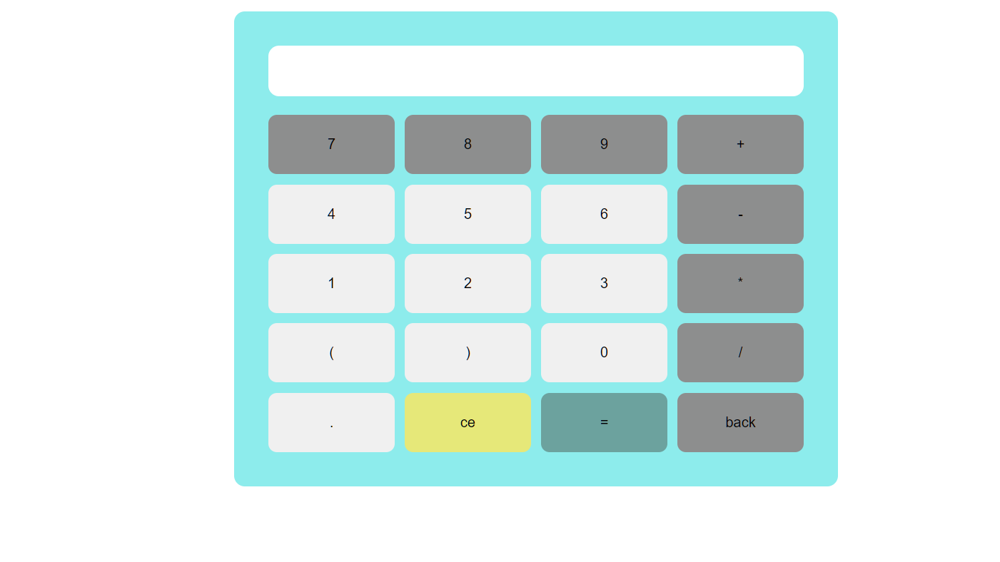

# About

## calculator
A simple calculator built using ReactJS. This project was created as an assignment while learning reactJS.

## 🔗Demo Link
https://samhith34.netlify.app/
 

- Built using reactJS
- Compatible with any device and fully responsive
- learn't hooks and probs in reactJS
- Completed in under 1 hours

As you can see, the calculator is compatible with any device and is fully responsive. Feel free to give me your suggestions and feedback on what to improve.

#reactJS #webdevelopment #learningeveryday #learncodeonline #javascirpt
 

# screenshot

